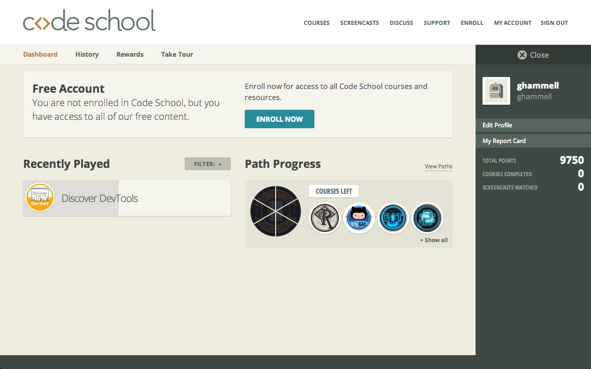

#### Include an inline screenshot of your codeschool's points from the profile page:

<!-- Modify the Markdown to include your answers. Don't delete the questions! -->

##QUIZ
* Explain which tabs support the following actions and how.
  * Realtime editing of HTML and CSS 
      * In the 'Elements' tab, to the left side is the HTML editor, and to the right is the CSS.  For each node in the HTML file, you can expand it, collapse it, edit attributes, add attributes, right in the editor.  You can do this by double clicking on an element, or by right clicking on it and selecting 'Edit as HTML'.  In the CSS panel to the right, you can properties on or off, adjust their values, or add new ones (as well as selectors).

  * Javascript Debugging
      * Javascript debugging can be performed through the 'Console' tab.

  * Performance Optimization 
      * Performance optimaztion can be done through the 'Network' tab, in conjunction with the 'PageSpeed' tab (from the chrome extension).  In the 'Network' tab, you can reload the page you're on to see what loads the fastest, in what order, and can see the file sizes as well.  PageSpeed will analyze your website and tell you what areas are slowing it down.

* What's the quick key for your OS to spawn the Dev Tools inspector?
      * On a mac:  alt + command + i

* Go to http://www.postmachina.com/ and analyze and tweak this nicely designed page.
  * What is the current background color for the page?  (Surprisingly, it's not just black!)
      * #0b0f11
  * Tweak the background color to white.
      * Done.
  * Tweak the height of the side bar that contains the logo.  Shrink it down to 85px.
      * Ok.
  * Roll over the navigation links.  When you hover over them, they dissapear.  Let's change the hover color to black instead.
      * You got it.
  * Now take a screenshot of your new (and maybe not so improved) design.  It should match this screenshot: http://postimg.org/image/5ak1jkpl5/
  * Upload your own image to the imgs directory in the `1_Chrome_Dev_Tools` directory.  It should match the image above. The last nav link in the image above is black because the mouse was hovering there when the screenshot was taken. Do the same, and don't take a screenshot of your whole desktop, just the browser window. (This is part of the challenge.)
      * Done!

* For the postmachina website, why can't you tweak the color of the text "The most important things are not things"?  Please explain.
    * Because it's an image.  You can see that the background to the paragraph element is set to a .gif image.  I'm not 100% sure, but I believe the text in the paragraph element is only there for.. whats that term we learned in week 1... semantic styling?  Basically its there so that it can be picked up by search engines.  I think.  But why doesn't the text appear anywhere?  Again, I'm not 100% sure, but I believe that's because the parent div element, id of "main" has it's "overflow" property set to "hidden".  But, I tried un-checking that property and nothing happened.

* Go to www.ticketswizard.com and analyze the page.  
  * What is the largest image on the website?
      * You mean in terms of size like MB right, not area?  I believe it is the image "92624182-c482-4a35-8da2-4fbf2f502e94_Large_Large.png", at 316KB.
  * Explain how you would find out this information, and list the URL of offending image here and how big it is.
      * I clicked into the 'Network' tab, and hit Shift + Refresh.  The 'Network' tab displays a list of all the objects on the website that load, and their size, amongst other things.  You can sort the list of objects by size by clicking the little triangle to the right of the 'Size' field name.  I used Shift + Refresh so that none of the image sizes would be stored in the cache (and subsequently not displayed).  The URL is:  http://www.ticketswizard.com/Images/Catalog/92624182-c482-4a35-8da2-4fbf2f502e94_Large_Large.png.

* Test the www.ticketswizard.com website with google's [PageSpeed Insights](http://www.ticketswizard.com/).  (You can also download the chrome plugin).  What is the easiest thing to change to optimize the website?  How many kilobytes of data can be eliminated?
    * Minimizing the payload; specifically, optimizing images.  This would eliminate 885.9 KiB.